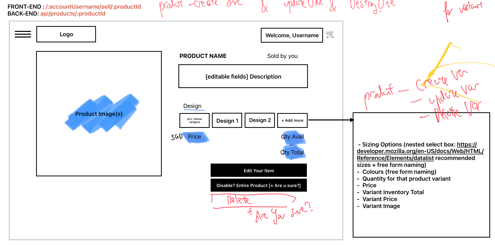

# JThreads

Welcome to our Merch Handling Website View what merch is available and start buying once you create an account with us ;)
[Use this link to try](https://jthreads.netlify.app/)

- [Content](#content-&-features)
- [Application Photos](#screengrabs-of-application)
- [Wireframes](#wireframes)
- [Planning](#planning)
- [Credits](#credits)

Slay

## Content & Features

User-related

- [x] Ability to Sign Up & Sign In with Validation Form
- [x] Restricted NavBar based on SignIn
- [x] See user's own profile
- [x] Unauthorised if trying to access other's site

Product-related

- [x] Public & logged in user can see all products
- [x] Can look at other user's products they put up
- [x] Can create & editing one's own listing and designs

Order-related

- [x] Validating Add to Cart to not exceed avail qty amount

### Special Features

- [x] Intense Validation everywhere (FE, BE, DB)
- [x] Managing product availability & inventory
- [x] Private Routing to prevent Unauthorised access

## Nomenclature / Terminology

## Screengrabs of Application

## Wireframes

## Planning

### FrontEnd Routes

### Backend Routes

#### Routes for User Data

##### Routes for Product Data

/public/buy --> List view of items to buy for public
/:userId/buy --> List view of items to buy for user
/:userId/buy/cart --> List view of items to buy for user [cart state stored in BuyPage, retained in Local storage? or only show cart via dialog box?]
/:userId/sell --> list view of items that user has put up to sell
/:userId/sell/:productId --> see One Product that use has put up (with all subproducts - colour, size, design)

##### Routes for Cart Data

##### Routes for Transaction Data

/:userId/buy/orders --> List view of transactions made by user
/:userId/buy/:orderId --> see view of one transaction
/:userId/sell/orders --> see view of all transactions
/:userId/sell/:orderId --> see view of one transaction

### Features & Splitting of Work

## Credits

Backend Techniques from:

- [eCommerce Model Definitions](https://dev.to/ezzdinatef/ecommerce-database-design-1ggc)

Frontend Techniques from:

- [Private Route](https://medium.com/@bhairabpatra.iitd/private-routes-in-react-559a7d8d161f)
- [MUI Controlled Form](https://dev.to/melissajlw/how-to-create-a-controlled-form-in-mui-material-ui-4gm9)
- [Validation in Forms](https://muhimasri.com/blogs/mui-validation/)
